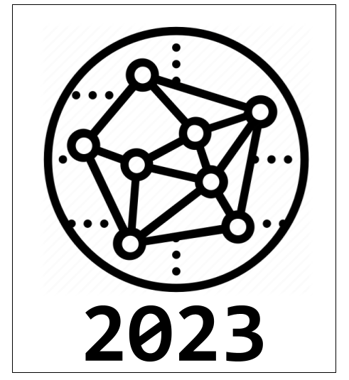

# ALGORITMOS Y ESTRUCTURAS DE DATOS II  

Vamos a utilizar este repositorio como medio de contacto.

* En la sección [Wiki](https://github.com/harpomaxx/algoritmos2/wiki) van a encontrar el material utilizado por la catedra durante las clases.
* En la seccion [Discussions](https://github.com/harpomaxx/algoritmos2/discussions) vamos a tener un espacio para notificarlos de las novedades y para que Uds hagan preguntas sobre la materia.

**PUEDEN DARLE WATCH AL REPO ASI ESTAN AL TANTO DE LAS NOVEDADES DE MANERA AUTOMATICA**
